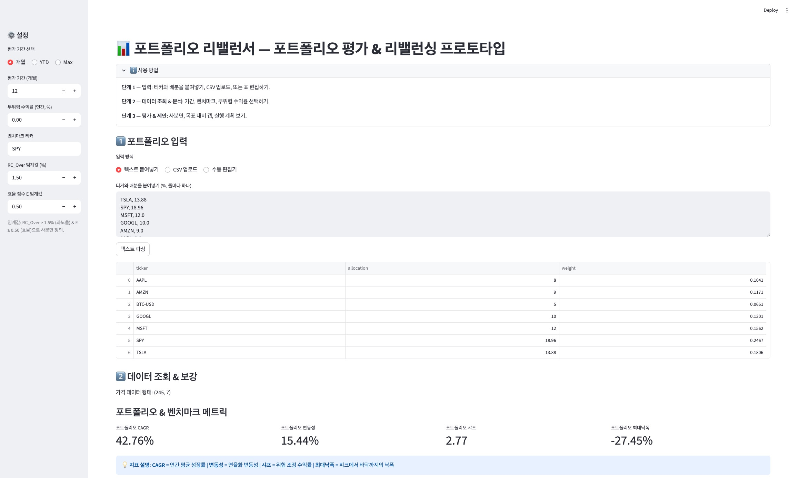

# 포트폴리오 리밸런서 (Portfolio Rebalancer)

Streamlit 기반의 포트폴리오 평가 및 리밸런싱 프로토타입입니다. 티커와 배분을 입력하면 가격 데이터를 조회하고, 핵심 지표를 계산한 뒤 2×2 사분면 분류(RC_Over% × 효율점수 E′)를 통해 실행 계획(증가/축소/세부 조정)을 제안합니다.



---

## 핵심 특징

- **3단계 워크플로우**: 입력 → 데이터 조회/보강 → 평가/제안
- **유연한 기간 선택**: 개월 수 지정 / YTD / Max 지원
- **다양한 티커 지원**: `yfinance` 기반, 주식/ETF/암호화폐(예: `BTC-USD`)
- **포트폴리오/벤치마크 지표**: CAGR, 변동성, 샤프, 최대낙폭, 추적오차, 정보비율
- **자산별 보강 데이터**: 위험기여도(RC), 수익기여도, 효율점수(E), 베타, 알파, YTD 수익률
- **모멘텀 보정**: YTD 수익률을 반영한 효율점수 E′ 계산 (가중치 조정 가능)
- **스무딩 처리**: 윈저라이징 + 이동평균으로 이상치 완화 및 공분산 안정화
- **2×2 사분면 분류**: RC_Over(%) × 효율점수(E′) 기준으로 Q1~Q4 자동 분류
- **RC 상한 체크**: 개별 자산의 위험기여도 상한선 위반 여부 확인
- **히스테리시스 & 최소거래**: 불필요한 소액 거래 필터링
- **CSV 다운로드**: 보강 메트릭, 실행 계획 내보내기

---

## 빠른 시작

### 요구사항

- Python 3.12 이상
- 네트워크 연결 (가격 데이터 조회용)
- 주요 의존성: `streamlit`, `yfinance`, `pandas`, `numpy`, `plotly`, `scipy`, `pydantic`

### 설치 및 실행 (권장: uv)

```bash
# 의존성 설치 (pyproject.toml 기준)
uv sync

# 앱 실행
uv run streamlit run main.py
```

### 설치 및 실행 (대안: pip/venv)

```bash
# 가상환경 생성 및 활성화 (예: macOS/Linux)
python3.12 -m venv .venv
source ./.venv/bin/activate

# 의존성 설치
pip install -r <(python - <<'PY'
import tomllib, sys
py=tomllib.load(open('pyproject.toml','rb'))
print('\n'.join(py['project']['dependencies']))
PY
)

# 앱 실행
streamlit run main.py
```

앱이 실행되면 브라우저에서 안내된 로컬 URL로 접속하세요.

---

## 사용 방법

앱 내의 안내대로 아래 흐름으로 진행합니다.

1) 포트폴리오 입력

- 입력 방식: 텍스트 붙여넣기, CSV 업로드(`ticker, allocation`), 수동 편집기
- 동일 티커는 합산되며, 배분(%)는 자동으로 0~1 가중치로 정규화됩니다.

2) 데이터 조회 & 보강

- 기간 선택: 개월 수 / YTD / Max
- 무위험 수익률(RF), 벤치마크 티커 설정
- 포트폴리오/벤치마크의 CAGR·변동성·샤프·최대낙폭·추적오차·정보비율 계산
- 자산별 보강 테이블: 위험기여도(RC), 수익기여도, 효율점수(E), 베타, 알파, YTD 수익률
- 모멘텀 보정: YTD 수익률을 반영한 효율점수 E′ 계산

3) 평가 & 실행 계획 제안

- **RC_Over%(x) vs 효율점수 E′(y) 사분면 분류**:
  - Q1 핵심: 낮은 RC_Over & 높은 E′ → 유지/증가
  - Q2 성장: 높은 RC_Over & 높은 E′ → 성장 잠재력, 위험 관리 필요
  - Q3 개선: 낮은 RC_Over & 낮은 E′ → 효율 개선 또는 축소 검토
  - Q4 위험관리: 높은 RC_Over & 낮은 E′ → 축소/청산 우선
- 티커별 목표 가중치(%)를 입력해 현재 대비 갭 분석
- RC 상한선 체크: 개별 자산의 위험기여도가 설정 상한을 초과하는지 확인
- 히스테리시스 & 최소거래 필터링으로 불필요한 소액 거래 제외
- 자동 생성된 실행 계획: (1) 축소 대상(Q4 또는 음수 갭), (2) 증가 대상(양수 갭), (3) 세부 조정(히스테리시스 대역 내)
- 결과 CSV 다운로드 제공

---

## 사이드바 설정

- **평가 기간 선택**: 개월(기본 12) / YTD / Max
- **무위험 수익률**(연간, %): 기본 0.0
- **벤치마크 티커**: 기본 `SPY`
- **RC_Over 임계값**(%): 기본 1.5 (위험 과노출 기준)
- **효율 점수 E 임계값**: 기본 0.5 (효율성 기준)
- **모멘텀 가중치**: 기본 0.2 (E′ 계산 시 YTD 수익률 반영 비율)

임계값은 2×2 사분면 경계를 정의합니다. x=RC_Over(%), y=효율점수(E′).

---

## 프로젝트 구조

```text
/portfolio_rebalancer
├─ main.py                 # Streamlit 엔트리포인트 (3단계 워크플로우)
├─ core/
│  ├─ asset.py             # 자산 모델, 텍스트 파싱
│  └─ models.py            # Pydantic 데이터 모델 (AssetMetrics, ProposalRow 등)
├─ steps/
│  ├─ portfolio_input.py   # 1) 입력 단계
│  ├─ data_analysis.py     # 2) 데이터 조회 & 보강
│  └─ evaluation_proposal.py # 3) 평가 & 실행 계획 제안
├─ utils/
│  ├─ data_fetcher.py      # yfinance 가격 조회, YTD 수익률 계산
│  ├─ helpers.py           # 지표/사분면 설명 헬퍼
│  └─ metrics.py           # 재무/리스크 계산 (CAGR, 샤프, RC, 효율점수, 스무딩 등)
├─ docs/                   # 개발 워크플로우/정리 문서
├─ pyproject.toml          # 의존성/툴링 설정
├─ uv.lock                 # 의존성 잠금 파일
└─ README.md               # 본 문서
```

모듈식 구조를 유지합니다: 페이지(`steps/`), 핵심 로직(`core/`), 유틸리티(`utils/`).

---

## 지표 정의(요약)

### 포트폴리오 수준

- **CAGR**: 복합 연간 성장률
- **변동성**: 연율화 표준편차(거래일 252일 기준)
- **샤프 지수**: (CAGR − RF) / 변동성
- **최대낙폭**: 피크 대비 최저점 낙폭
- **추적오차**: 포트폴리오와 벤치마크 수익률 차이의 표준편차
- **정보비율**: (포트폴리오 CAGR − 벤치마크 CAGR) / 추적오차

### 자산별

- **위험기여도(RC)**: 공분산 기반 위험 분해에서 각 자산의 비율
- **수익기여도**: 자산 CAGR × 가중치 (근사)
- **효율점수(E)**: 샤프 지수를 0~1 범위로 정규화한 값 (E = Sharpe / (1 + |Sharpe|))
- **효율점수 E′**: 모멘텀 보정 적용 (E′ = E × (1 − w) + YTD수익률 정규화 × w, w=모멘텀 가중치)
- **RC_Over**: 현재 RC − 목표 RC (음수는 0으로 클리핑)
- **베타**: 벤치마크 대비 민감도
- **알파**: 벤치마크 대비 초과 수익률

자세한 설명은 앱 내의 "지표 설명" 확장 영역을 참고하세요.

---

## 개발 원칙(MVP)

본 프로젝트는 다음 원칙을 따릅니다.

- MVP 중심: 핵심 기능부터 빠르게 완성 → 피드백 기반 개선
- 동작 확인 우선: 변경 후 `streamlit run main.py`로 즉시 검증
- 모듈식 구조: `pages/`, `core/`, `utils/` 책임 분리
- KISS: 과도한 추상화/최적화 금지, 필요한 때만 도입
- YAGNI: “나중에 필요할 듯”한 불필요 기능 금지
- 타입 힌트와 일관된 명명, 안전한 외부 입력 검증

코드 내 AIDEV 주석 규칙 활용 예:

```python
# AIDEV-NOTE: cache-strategy; yfinance 호출이 느려서 @st.cache_data 사용
# AIDEV-TODO: add-error-handling; 네트워크 실패 시 재시도 로직 미구현
# AIDEV-FIXME: sharpe-ratio-div-zero; 분모 0 가능성 (임시 max 처리)
```

---

## 자주 쓰는 명령어

```bash
# 코드 포매팅
uv run ruff format .

# 린팅 및 자동 수정
uv run ruff check . --fix

# 앱 실행
uv run streamlit run main.py
```

---

## 데이터 및 주의사항

- **데이터 출처**: `yfinance` (조정 종가). 공급자/네트워크 상태에 따라 조회 실패/지연 가능
- **목적**: 교육/프로토타이핑 목적이며 투자 자문이 아닙니다
- **암호화폐/특수 티커**: 가용성/연속성 이슈가 있을 수 있습니다
- **스무딩 처리**: 윈저라이징 + 3-window 이동평균으로 이상치 완화 (자동 적용)
- **모멘텀 보정**: YTD 수익률을 반영한 E′ 계산으로 단기 성과를 고려 (가중치 조정 가능)

---

## 트러블슈팅

- **가격 데이터 없음 경고**: 티커 오타, 기간 과도, 휴장일, 데이터 미지원 가능성 확인
- **빈 데이터프레임/NaN 지표**: 기간 내 데이터 부족 또는 결측치 제거 영향
- **네트워크 오류**: 재시도 또는 기간 축소, 티커 수 축소 권장
- **YTD 기간 선택 시 데이터 부족**: 연초부터 현재까지 데이터가 부족할 경우 개월 수 지정 권장
- **효율점수 E/E′ 이상값**: 샤프 지수가 극단적인 경우 발생 가능, 스무딩 처리로 완화
- **RC 상한 위반 경고**: 개별 자산의 위험기여도가 설정 상한을 초과하는 경우 표시
- **macOS 보안 경고**: `xattr -d com.apple.quarantine ~/.local/bin/uv` 등 환경에 맞는 조치 필요

---

## 라이선스

사내/개인 용도 프로토타입. 별도 명시 전까지 외부 배포/상업적 이용 전 검토 필요.
