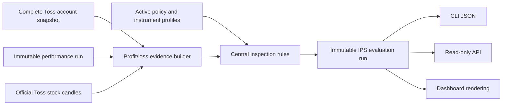

# Phase 5 Profit/Loss and Exceptional-Review Design

**Status:** Approved direction; implementation has not started

**Scope:** Toss-only IPS inspection evidence and human-review signals

**Depends on:** immutable Toss snapshots, account performance runs, active IPS policy and profiles, official Toss daily candles, and the Phase 3 inspection engine

## Purpose

Phase 5 connects account and instrument profit/loss evidence to allocation,
drawdown, and IPS profile quality. It helps the user decide what deserves human
inspection without converting gains, losses, or price moves into automatic
trading instructions.

The feature must answer four questions:

1. What account and instrument profit/loss evidence is currently supported?
2. Is a drawdown material under the active IPS review thresholds?
3. For satellite and experiment holdings, are thesis, overlap, management
   burden, holdability, and ETF substitution explicitly reviewed?
4. Does any instrument meet the narrow exceptional-review condition of a
   broken thesis and its own hard maximum-weight breach?

## Product Guardrails

- Preserve the status vocabulary exactly: `OK`, `Watch`, `Review`, `Action`.
- `Action` means inspect a possible exceptional intervention. It is not
  permission or an instruction to trade.
- `Action` requires both `thesis_status = broken` and the same instrument's
  invested weight to exceed its active policy maximum.
- Layer maximum breaches, account drawdown, instrument drawdown, gains, losses,
  overlap, burden, holdability, and ETF substitution can produce at most
  `Review` by themselves.
- A gain, loss, drawdown, cash deviation, or price move never creates direct
  buy, sell, stop-loss, take-profit, order-size, or execution language.
- Future regular-purchase-policy review remains the default allocation response.
- Toss snapshots are the only source of holdings, costs, values, orders, and
  executions. Toss daily candles are the only price-history source.
- Missing, stale, partial, unreconciled, or ambiguous evidence fails closed.
- Core, satellite, and experiment remain first-class layers.

## Approaches Considered

### 1. Evidence bundle plus structured profile factors — selected

Build pure, source-linked profit/loss and drawdown evidence, extend profiles
with four structured human-review factors, and let the existing inspection
engine remain the single status authority.

This preserves the current immutable evaluation contract, keeps qualitative
judgments explicit, and avoids pretending that market data can determine
management burden or ETF suitability.

### 2. Fully automatic inference — rejected

Infer thesis quality, overlap, holdability, and ETF substitution from return,
drawdown, and weights. Toss does not supply the user's conviction, management
capacity, or complete ETF constituent overlap. The result would create false
precision and unreliable review signals.

### 3. Separate risk-run persistence model — deferred

Create an independent immutable risk run and reference it from inspection
runs. This offers strong separation but duplicates run selection, persistence,
fingerprinting, CLI, and API concepts. Phase 5 can preserve reproducibility by
embedding a compact market-evidence snapshot and fingerprint in the existing
evaluation run. A separate run is unnecessary until risk evidence has an
independent lifecycle.

## Architecture



`services/risk_evidence.py` owns pure metric calculation and evidence-quality
checks. It never assigns `OK`, `Watch`, `Review`, or `Action`.

`services/inspection_engine.py` remains the only source of status, trigger,
meaning, queue priority, and verification-task rules. CLI, API, and frontend
surfaces render the persisted result without reclassification.

`services/inspection_service.py` selects the exact snapshot, performance run,
policy, profile snapshot, and candle ranges; builds evidence; computes a market
evidence fingerprint; and persists the complete evaluation input identity.

## Evidence Model

### Account evidence

The evaluation result adds an `account_profit_loss` object:

```json
{
  "snapshot_id": 4,
  "performance_run_id": 1,
  "cost_basis_krw": 92420209.47,
  "unrealized_pnl_krw": 28376515.64,
  "unrealized_return": 0.3070,
  "tracked_realized_pnl_krw": null,
  "actual_realized_pnl_krw": null,
  "realized_pnl_supported": false,
  "drawdown": {
    "state": "insufficient_history",
    "current": null,
    "maximum": null,
    "history_points": 1
  }
}
```

- Cost basis and unrealized profit/loss come from the selected normalized Toss
  snapshot through the selected performance point.
- Unrealized return is `unrealized_pnl_krw / current_cost_basis_krw` only when
  both values are finite and cost basis is positive.
- Realized profit/loss is supported only when the selected performance run has
  reconciled post-baseline execution evidence. No executions means unsupported,
  not a factual zero.
- Account drawdown is calculated from the compounded evaluable TWR curve, not
  raw account value. External cash flows therefore do not become drawdown.
- Account drawdown is unavailable with fewer than two connected evaluable
  points or across an unresolved performance boundary.
- `current` is the latest TWR-curve value below its prior peak. `maximum` is the
  worst peak-to-trough drawdown in the supported history. Only current drawdown
  participates in the current review rule.

### Instrument evidence

Each instrument result adds an `evidence` object:

```json
{
  "snapshot_id": 4,
  "market_value_krw": 10000000.0,
  "cost_basis_krw": 8000000.0,
  "unrealized_pnl_krw": 2000000.0,
  "unrealized_return": 0.25,
  "drawdown": {
    "state": "complete",
    "current": -0.11,
    "maximum": -0.24,
    "lookback_sessions": 252,
    "history_points": 252,
    "first_candle_at": "2025-07-22T00:00:00+00:00",
    "latest_candle_at": "2026-07-22T00:00:00+00:00",
    "source_fingerprint": "..."
  }
}
```

- Market value, cost, unrealized profit/loss, and return are snapshot facts.
- Drawdown uses adjusted official Toss daily stock closes in native market
  currency. It is not an account return and does not include portfolio cash-flow
  effects.
- The selected range is the latest 252 sessions at or before the account
  snapshot timestamp.
- At least 200 valid adjusted sessions are required. The latest candle may be at
  most seven calendar days old, matching the Phase 4 freshness boundary.
- Invalid, duplicate, conflicting, future-dated, unadjusted, stale, gapped, or
  insufficient candle history yields a null drawdown and an explicit evidence
  state.
- KRW-converted profit/loss and native-price drawdown are labeled separately and
  are never algebraically combined.

### Market evidence identity

Each instrument's selected candle range produces a canonical fingerprint from
its identity, first and last timestamps, point count, and ordered candle source
fingerprints. The evaluation stores:

- `market_evidence_fingerprint` at the run level;
- one compact evidence descriptor per instrument;
- the exact account snapshot, performance run, policy version, and profile hash.

The evaluation fingerprint includes the market evidence fingerprint and the
new engine version. Appending relevant candles therefore creates a new immutable
evaluation, while unchanged inputs reuse the existing evaluation.

## Structured Profile Review Factors

The Toss instrument profile gains explicit app-owned IPS metadata:

| Field | Allowed values | Meaning |
|---|---|---|
| `overlap_status` | `unknown`, `clear`, `review` | Whether the holding creates material role or exposure overlap |
| `management_burden_status` | `unknown`, `clear`, `review` | Whether monitoring and decision burden remains acceptable |
| `holdability_status` | `unknown`, `clear`, `review` | Whether the user can hold it through its expected volatility and drawdown |
| `etf_substitution_status` | `unknown`, `not_applicable`, `clear`, `review` | Whether a simpler ETF alternative should be reviewed |
| `review_factors_note` | text | Human rationale shared across the four factors |

These fields annotate a Toss-observed identity and cannot create an independent
holding. A forward SQLite migration adds explicit columns with `unknown`
defaults and preserves every existing profile and evaluation.

For core holdings, `unknown` factors are visible but do not create a review by
themselves. An explicit `review` value does create `Review`.

For satellite and experiment holdings, every factor must be `clear` or, for ETF
substitution, `not_applicable`. Any `unknown` or `review` value produces one
instrument-level `Review` item containing all affected factors. It does not
produce one queue item per factor.

The system does not infer these fields from returns or ticker names. They remain
human IPS judgments managed through the existing profile CLI until Phase 6
provides authenticated browser editing.

## Policy Extension

The immutable policy gains a `risk_review` section:

```json
{
  "risk_review": {
    "lookback_sessions": 252,
    "minimum_history_points": 200,
    "max_data_age_days": 7,
    "max_gap_days": 7,
    "account_drawdown_review": -0.15,
    "instrument_drawdown_review": {
      "core": -0.25,
      "satellite": -0.20,
      "experiment": -0.15
    }
  }
}
```

These are inspection thresholds, not stop-loss levels:

- Account current drawdown at or below 15% produces `Review`.
- Core current drawdown at or below 25% produces `Watch` when no stronger
  condition exists.
- Satellite current drawdown at or below 20% produces `Review`.
- Experiment current drawdown at or below 15% produces `Review`.
- Maximum historical drawdown is factual context only.
- Changing a threshold requires a new validated policy version. Phase 5 does
  not automatically activate the policy or mutate the brokerage account.

Validation requires negative finite drawdown values greater than `-1`, exact
layer keys, `minimum_history_points <= lookback_sessions`, and positive integer
history, freshness, and maximum-gap values.

## Deterministic Status Matrix

Rules are applied to each instrument in this order, with the highest severity
winning and all supporting triggers retained:

| Condition | Maximum status from this condition | Trigger |
|---|---:|---|
| Profit or loss exists with no other condition | `OK` | Evidence only; no trigger |
| Drawdown evidence is missing, stale, or invalid | `Watch` | `instrument_drawdown_evidence_unavailable` |
| Core drawdown crosses its threshold | `Watch` | `core_drawdown_review_threshold` |
| Satellite or experiment drawdown crosses its threshold | `Review` | `strict_layer_drawdown_review_threshold` |
| Instrument exceeds its maximum and thesis is not broken | `Review` | `instrument_hard_maximum_breach` |
| Positive profit/loss and instrument maximum breach coexist | `Review` | `gain_with_instrument_overweight` |
| Negative profit/loss and thesis or holdability concern coexist | `Review` | `loss_with_thesis_or_holdability_concern` |
| Thesis is `watch` | `Watch` | `thesis_watch` |
| Thesis is `broken`, within maximum | `Review` | `thesis_broken` |
| Explicit profile factor is `review` | `Review` | factor-specific trigger |
| Satellite/experiment profile factor is `unknown` | `Review` | factor-specific `*_unknown` trigger |
| Thesis is `broken` and the same instrument exceeds its maximum | `Action` | `broken_thesis_and_hard_maximum_breach` |

Additional invariants:

- Layer maximum breach remains a layer `Review` and cannot satisfy an
  instrument's `Action` condition.
- Loss and drawdown can explain why thesis or holdability deserves review, but
  they never satisfy the hard-risk half of `Action`.
- Cash status does not satisfy an instrument's `Action` condition.
- Incomplete account source evidence keeps the evaluation non-evaluable as it
  does today.
- Optional market evidence being unavailable does not erase a separately
  supported broken-thesis and hard-maximum condition, but its absence is shown
  as a `Watch` trigger.

At account level, unsupported drawdown history produces `Watch` with
`account_drawdown_evidence_unavailable`; crossing the approved account threshold
produces `Review` with `account_drawdown_review_threshold`. Account profit or
loss remains factual evidence and does not escalate status by itself.

## Trigger Explanations and Verification Tasks

Every non-`OK` unit retains the existing shape:

```json
{
  "status": "Review",
  "triggers": ["strict_layer_drawdown_review_threshold"],
  "meaning": "Satellite 보유의 현재 drawdown이 승인된 검토 기준을 넘었습니다.",
  "verification_task": "투자 논지, 보유 가능성, 중복, 관리 부담과 ETF 대체 가능성을 다시 확인합니다."
}
```

Allowed next-step language is limited to:

- hold and observe;
- verify data quality;
- review thesis, overlap, burden, holdability, or ETF substitution;
- review future regular-purchase policy;
- inspect a possible exceptional intervention and hold if its required
  conditions are not confirmed.

The engine does not emit `buy`, `sell`, `stop loss`, `take profit`, order
quantity, target transaction value, or execution fields.

## Review Queue

- Keep one queue item per inspection unit. Multiple triggers are combined.
- Sort by severity first, then deterministic reason priority, kind, and identity.
- `Action` items come first.
- Broken-thesis `Review` items precede structured-profile reviews.
- Allocation and drawdown reviews follow.
- Evidence-availability `Watch` items come last.
- The queue preserves evidence references so a human can trace the exact
  snapshot, performance run, policy version, profile update, and candle range.

## CLI and API Contracts

### CLI

- Extend `profiles set` with the four structured factor options and a shared
  factor note.
- Preserve one JSON object on stdout and machine-readable validation errors.
- Add `inspection preview --policy-file` to validate and evaluate a proposed
  policy against current local evidence without activating the policy or
  persisting an evaluation run.
- `inspection run` automatically selects the relevant stored Toss candles and
  records their fingerprint.
- `inspection show` returns persisted evidence exactly as stored.
- Do not add trade, order, execution, or position-sizing commands.

### API

The existing read-only inspection endpoint returns the expanded persisted
evaluation result. No new write endpoint is introduced. Existing profile and
policy reads include the new fields. Broker mutation remains blocked.

## Dashboard Presentation

No new top-level tab is required.

- **Overview:** show only the count and highest status of exceptional-review
  items. Do not add another dense profit/loss table.
- **Performance:** add account current/max drawdown, supported realized
  profit/loss, and clear evidence-availability labels alongside YTD, recent
  12-month, cumulative TWR, and holding unrealized return.
- **Allocation:** add instrument unrealized return, current drawdown, and a
  compact profile-factor summary. Preserve horizontal scrolling on narrow
  screens.
- **Profiles & policy:** show the four structured review factors and their note.
- **Review Queue:** render the backend trigger, plain meaning, verification task,
  and a collapsed evidence-reference detail. The browser does not derive status.

All KRW amounts remain whole won in the presentation layer. Missing values show
`산출 전`, `자료 없음`, or the exact evidence state rather than zero.

## Persistence and Migration

Schema migration 8 is forward-only and transactional:

1. Add the four factor-status columns and `review_factors_note` to
   `ips_instrument_profiles`, defaulting to `unknown` and an empty note.
2. Add nullable `market_evidence_fingerprint` and a canonical
   `market_evidence_json` object to `ips_evaluation_runs` for new evaluations.
3. Preserve historical evaluation result JSON and engine versions unchanged.
4. Bump the inspection engine identity to `phase5-v1` so new semantics cannot
   collide with previous fingerprints.

No compatibility portfolio, manual holding, yfinance, generic broker, or
Japan-account path is introduced.

## Failure Handling

- Non-complete or unreconciled Toss account snapshots remain non-evaluable.
- A missing performance run makes account drawdown and realized evidence
  unavailable and produces the existing performance review behavior.
- A missing or non-positive cost basis makes unrealized return null; amount
  evidence remains visible if supported.
- Missing or stale stock candles make only the affected instrument drawdown
  unavailable.
- Unsupported adjusted prices, duplicate timestamps, conflicts, or long gaps
  fail the drawdown calculation closed.
- Missing profile factors do not create `Action`.
- Invalid policy thresholds prevent policy activation.
- Every error remains machine-readable at the CLI and API boundaries.

## Verification Strategy

### Pure calculation tests

- Account TWR-curve current and maximum drawdown.
- Instrument 252-session current and maximum drawdown.
- Insufficient, stale, future, duplicate, invalid, unadjusted, and gapped candle
  histories.
- Positive cost-basis return and missing/zero cost-basis behavior.

### Policy and profile tests

- Risk threshold range and exact layer-key validation.
- Forward migration preserves current profiles and evaluations.
- New factor enums reject invalid states and preserve deterministic reads.

### Engine truth-table tests

- Gain alone, loss alone, and drawdown alone never produce `Action`.
- Layer maximum breach plus broken thesis does not produce instrument `Action`.
- Instrument maximum breach without broken thesis produces `Review`.
- Broken thesis without instrument maximum breach produces `Review`.
- Broken thesis plus the same instrument maximum breach produces `Action`.
- Satellite/experiment unknown factors produce one combined `Review` item.
- Core unknown factors do not create a review by themselves.
- Missing evidence never becomes a trade instruction.

### Persistence and surface tests

- Market evidence changes the evaluation fingerprint; identical inputs reuse it.
- CLI stdout remains one JSON object.
- API returns persisted statuses without reclassification.
- Frontend renders missing evidence distinctly from zero and exposes evidence
  references without source metadata dominating the Overview.
- Offline Toss fixtures cover KR and US stock candles; no test requires live
  market data.
- A repository-wide forbidden-output check rejects order sizing, execution
  flags, and direct buy/sell recommendations in Phase 5 result fields.

## Rollout

1. Apply the forward schema migration without changing active policy or current
   evaluation rows.
2. Add evidence calculation and persistence contracts behind tests.
3. Extend profile CLI and populate structured factors through explicit human
   review. Existing values begin as `unknown`.
4. Sync official Toss stock candles for observed holdings.
5. Validate a new policy version containing `risk_review`; do not activate it
   automatically.
6. Run a dry inspection and adversarially review the result and wording.
7. Activate the policy only after explicit user approval, then persist the first
   `phase5-v1` evaluation and verify the dashboard.

The current database has no stored stock candles, no post-baseline execution
ledger rows, and all 16 profiles have `thesis_status = unknown`. The first dry
run is therefore expected to show unavailable drawdown/realized evidence and
profile-completeness reviews. It must not display false zeroes or `Action`.

## Adversarial Review

The design was challenged against the following failure modes:

- **Profit becomes a take-profit signal:** prevented because profit has no
  standalone trigger and overweight remains the actual review condition.
- **Loss becomes a stop-loss signal:** prevented because loss and drawdown only
  request thesis or holdability review.
- **Layer breach accidentally satisfies `Action`:** prevented by requiring the
  same instrument's policy maximum.
- **ETF overlap is fabricated:** prevented by keeping overlap and substitution
  as structured human profile judgments.
- **Raw account values distort drawdown after cash flows:** prevented by using
  the evaluable TWR curve.
- **Old or partial candles create false certainty:** prevented by adjusted-data,
  history, freshness, gap, and timestamp gates.
- **Market inputs are omitted from reproducibility:** prevented by adding the
  market evidence fingerprint to the evaluation fingerprint.
- **Existing profiles silently appear reviewed after migration:** prevented by
  defaulting every new factor to `unknown`.
- **Current empty execution ledger appears as zero realized profit/loss:**
  prevented by a separate `realized_pnl_supported` flag and null amounts.
- **Queue floods with one item per missing factor:** prevented by aggregating all
  factor triggers into one item per instrument.
- **Frontend reinterprets severity:** prevented by keeping all status and
  priority rules in the backend engine.
- **Phase 5 mutates the active policy during rollout:** prevented by a validate,
  dry-run, explicit-approval, activation sequence.

## Acceptance Criteria

Phase 5 is complete only when:

- every profit/loss and drawdown value traces to exact immutable source evidence;
- missing evidence is distinguishable from zero;
- satellite and experiment profile factors are structured and reviewable;
- all statuses come from one backend rule matrix;
- `Action` occurs only for broken thesis plus the same instrument's hard maximum
  breach;
- no output contains direct trading or order-sizing semantics;
- policy activation and brokerage mutation remain outside automatic execution;
- migration, unit, integration, CLI, API, and browser checks pass without live
  market dependencies.
