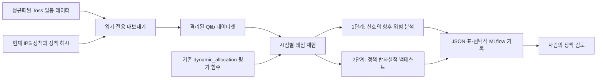

# Qlib 동적 배분 정책 검증 설계

작성일: 2026-07-28
상태: 승인된 설계

## 1. 목적

Microsoft Qlib을 IPS Pilot의 운영 경로에 넣지 않고, 현재 동적 시장 배분 규칙의 과거 하방 방어 효과를 검증하는 격리된 연구 환경으로 사용한다.

검증의 1차 목적은 고정 중립 정책보다 최대 낙폭을 줄이는지 확인하는 것이다. 2차 목적은 그 대가로 포기하는 연환산 수익률과 레짐 전환 빈도를 측정하는 것이다. 동적 정책의 연환산 수익률 감소 허용 한도는 고정 중립 정책 대비 최대 2%p로 고정한다.

이 연구는 IPS 검사 결과나 투자 행동을 자동으로 변경하지 않는다. 결과는 사람이 정책을 검토하기 위한 연구 근거일 뿐이며 주문, 매수·매도 판단 또는 `OK`, `Watch`, `Review`, `Action` 상태를 생성하지 않는다.

## 2. 결정 사항

- 첫 구현은 결정론적 역사 재현 방식으로 한다. 임계값 탐색이나 ML 모델은 후속 연구로 남긴다.
- Qlib은 별도 `research/qlib_validation/` 환경에서 데이터셋, 백테스트, 실험 기록을 담당한다.
- 레짐 판단은 `services/dynamic_allocation.py`의 기존 평가 함수를 단일 진실 공급원으로 사용한다. Qlib 쪽에서 규칙이나 상태를 다시 구현하지 않는다.
- 데이터 원천은 정규화된 Toss 일봉 시장 데이터로 제한한다. 보유량, 현금, 원가, 가격, 주문 및 체결 사실은 기존 Toss 계좌 스냅샷 계약을 변경하지 않는다.
- 현재 활성 IPS 정책의 종목 집합을 반사실적 검증 대상 universe로 고정하고 실행 시 정책 해시를 기록한다.
- 고정 중립 기준 정책은 기존 `build_neutral_policy()`로 생성하고, 동적 목표는 기존 `evaluate_dynamic_allocation()`이 반환한 후보를 사용한다. 연구 코드에 계층·종목 비중 계산을 별도로 복제하지 않는다.
- 검증은 1단계 레짐 신호 분석과 2단계 전체 정책 백테스트로 나눈다. 2단계 데이터 계약을 충족하지 못해도 1단계 결과는 별도로 작성할 수 있다.
- 기존 SQLite 평가, 정책 후보, 계좌 스냅샷, API, CLI, 프런트엔드에는 쓰거나 연결하지 않는다.
- MLflow 기록은 선택 기능이다. 로컬 JSON·표 보고서 생성을 필수 경로로 유지한다.

## 3. 범위와 비범위

### 포함

- SPY, QQQ, KOSPI, KOSDAQ 기반의 기존 네 가지 시장 레짐 증거 재현
- 현재 정책에 포함된 모든 종목을 사용한 고정 중립 정책과 동적 정책 비교
- 향후 20·60거래일 하방 위험 분석
- 최대 낙폭, 변동성, 최악 일간·월간 수익률, 회복 기간, CAGR, 회전율, 레짐 전환 횟수 측정
- 환율, 시장별 거래일, 거래비용과 가격 조정 품질에 대한 데이터 적격성 검사

### 제외

- Qlib Alpha158·Alpha360 또는 ML 모델을 이용한 새로운 매매 신호 생성
- 동적 배분 임계값 최적화
- 정책 자동 활성화 또는 운영 런타임 통합
- 과거 시점의 종목 선정 능력 검증
- 실제 주문, 주문 수량, 매수·매도 권고 생성

현재 정책 종목을 과거에 고정하는 방식에는 생존편향이 있다. 따라서 결과는 “현재 종목 구성에 현재 동적 레짐 규칙을 적용했다면 어땠는가”라는 조건부 질문에만 답한다. 역사적 universe 선택의 우수성이나 실제 과거 투자 가능성을 주장하지 않는다.

## 4. 아키텍처

예정된 연구 패키지는 다음 책임을 분리한다.

- 내보내기: 원본 저장소를 읽기 전용으로 열고 적격 데이터를 Qlib 형식으로 변환한다.
- 재현: 각 평가 시점의 정보만 전달하여 기존 레짐 평가 함수를 호출한다.
- 1단계 분석: 레짐 이후의 미래 위험 지표를 계산하고 에피소드별 견고성을 확인한다.
- 2단계 백테스트: 고정 중립 정책과 동적 정책의 포트폴리오 경로를 동일한 데이터·비용 가정으로 비교한다.
- 보고: 입력, 가정, 제외 사유, 지표, 판정을 재현 가능한 실행 단위로 저장한다.

Qlib은 데이터 및 연구 실행 도구이지 판단 규칙의 소유자가 아니다. Qlib 설치나 실행 실패가 IPS Pilot 운영 기능에 영향을 주지 않도록 의존성과 실행 경로를 격리한다.

## 5. 데이터 계약

### 5.1 공통 입력

- 정규화된 Toss 일봉 OHLCV
- 명시적으로 검증된 조정 가격 또는 기업행동 조정 계수
- 종목 식별자와 시장 구분
- 시장별 거래일
- 활성 정책의 종목, 계층, 중립 목표 비중 및 정책 해시
- 실행 코드 버전과 `as_of` 시점

`factor=1.0`은 기업행동이 없다고 검증된 경우에만 허용한다. 임의로 채워 넣은 조정 계수로 장기 수익률을 계산하지 않는다. 상장 전이나 데이터가 없는 종목을 다른 종목으로 대체하지 않는다.

Qlib 변환 도구는 현재 인터페이스의 `--data_path`를 사용한다. 참조한 한국어 시작 문서의 `--csv_path` 예시는 현재 Qlib 변환 스크립트와 맞지 않으므로 그대로 사용하지 않는다.

### 5.2 1단계 추가 조건

- 레짐 평가에 필요한 종목별 최소 200거래일
- 각 월말 평가 시점까지 공개된 데이터만 포함한 시계열 절단
- 미래 20·60거래일 결과를 계산할 수 있는 후행 관측 구간

1단계의 종목별 위험 지표는 우선 현지 통화 수익률로 계산할 수 있다. 이 결과를 전체 포트폴리오 성과로 해석하지 않는다.

### 5.3 2단계 추가 조건

- 전체 정책 종목의 조정 가격
- 일별 USD/KRW 환율
- 미국·한국 시장 거래일과 다음 거래 가능일 결정 규칙
- 시장별 거래비용과 필요한 경우 세금 가정

환율이나 핵심 가격 이력이 없으면 전체 포트폴리오 결과를 임의 환산하지 않는다. 해당 실행의 2단계 판정은 `inconclusive`로 기록한다.

## 6. 역사 재현 방법

### 6.1 공통 시점 규칙

평가는 월말 종가 확정 후 수행된 것으로 간주한다. 시점 `t`의 레짐 평가에는 `t`까지의 데이터만 전달한다. 목표 배분 변경은 각 종목이 실제 거래 가능한 다음 거래 세션부터 반영한다.

레짐은 시간순으로 재생하며 기존 30일(달력일) 쿨다운을 그대로 적용한다. 직전 적용 정책과 적용 시점을 재현 상태로 운반하지만, 레짐 분류 임계값이나 예외 규칙은 연구 코드에 복제하지 않는다.

기존 평가 함수는 정책을 자동 변경하지 않고 `candidate_state`와 `proposed_policy`를 반환한다. 동적 정책 백테스트에서만 다음과 같은 통제된 반사실적 가정을 둔다.

- `candidate_state == "candidate"`인 유효 후보는 사람이 승인했다고 가정하고 다음 거래 가능일부터 적용을 예약한다.
- `observe`이거나 데이터 검증에 실패한 결과는 현재 재현 정책을 유지한다.
- 적용된 후보만 재현 정책과 `last_change_at`을 갱신하며 이후 평가의 쿨다운 기준이 된다.
- 이 기계적 승인 가정은 두 정책 경로를 비교하기 위한 연구 모형일 뿐 운영 환경의 자동 승인이나 거래 권한을 뜻하지 않는다.

평가 함수가 내부적으로 반환하는 IPS `status`는 연구 판정으로 복사하거나 재해석하지 않는다. 연구 보고서에는 데이터 적격성, 후보 상태·사유와 연구 전용 판정만 기록한다.

현재 레짐 정책은 다음 계층 목표를 사용한다.

| 레짐 | 현금 | Core | Satellite | Experiment |
|---|---:|---:|---:|---:|
| `risk_on` | 3% | 52% | 44% | 4% |
| `neutral` | 5% | 60% | 38% | 2% |
| `risk_off` | 10% | 70% | 29% | 1% |

2단계에서 한 계층의 총비중이 바뀔 때 그 계층 안의 종목 비중은 활성 정책의 중립 목표 비중 비율을 유지한 채 비례 조정한다. 계층이 없거나 목표 합계가 유효하지 않으면 추측하지 않고 데이터 계약 오류로 처리한다.

### 6.2 1단계: 레짐 신호 검증

각 월말 평가점에서 기존 레짐 평가 결과를 기록하고 이후 20·60거래일 동안 다음을 계산한다.

- 실현 변동성
- 최대 낙폭
- 최악 일간 수익률
- 회복 기간

`risk_off` 이후의 하방 결과가 `neutral` 또는 `risk_on` 이후보다 실제로 악화했는지 비교한다. 미래 구간이 겹쳐 관측치가 독립인 것처럼 보이는 오류를 피하기 위해 다음 두 단위를 함께 보고한다.

- 월말 관측치 기준 효과 크기와 블록 부트스트랩 신뢰구간
- 연속된 같은 레짐을 묶은 에피소드 기준 효과와 에피소드 제외 민감도

1단계는 레짐 신호가 2단계 전체 정책 검증을 진행할 근거가 있는지 평가한다. 단독으로 정책 활성화를 정당화하지 않는다.

### 6.3 2단계: 전체 정책 반사실적 백테스트

같은 데이터, 환율, 거래일과 비용 가정 아래 다음 두 경로를 비교한다.

- 고정 중립 정책: 현금/Core/Satellite/Experiment를 항상 `5/60/38/2`로 유지
- 동적 정책: `risk_on`, `neutral`, `risk_off` 목표와 30일 쿨다운을 적용

두 경로는 공통 단위 NAV, KRW 기준, 외부 입출금 없는 상태에서 시작한다. 최초 비교 가능일에는 기존 `build_neutral_policy()`가 만든 동일한 중립 목표로 초기화한다. 계좌의 실제 과거 보유량, 세금 lot 또는 현금 흐름을 재구성하지 않는다.

두 경로 모두 같은 월말 평가 주기에 현재 목표 비중으로 리밸런싱한다. 동적 경로는 유효 후보가 있을 때만 목표 자체가 바뀌며, 쿨다운 중에는 직전 목표를 유지한다. 이렇게 하면 레짐 효과와 서로 다른 리밸런싱 주기의 효과가 섞이지 않는다.

리밸런싱은 월말 평가에서 발생한 유효 후보를 승인했다고 가정한 후 다음 거래 가능일부터 발생한 것으로 처리한다. 동적 후보의 쿨다운 시작 시점은 영향을 받는 종목 중 하나가 처음 거래 가능한 목표 적용일로 기록한다. 거래비용은 실제 변경된 비중에만 적용한다. 시장 휴장일이 다르면 종목별 다음 거래 가능일을 사용하며 아직 거래되지 않은 목표 변경을 소급 적용하지 않는다.

현금 수익률은 기본 시나리오에서 0%로 두고 실행 manifest에 기록한다. 별도 현금 수익률 자료를 사용하려면 출처와 시점 정합성을 명시한 승인된 민감도 시나리오로 추가한다. 이 가정은 현금 비중이 큰 `risk_off`에 보수적이다.

이 결과는 목표 배분 규칙의 이론적 비교이며 실제 IPS 계좌 성과나 즉시 매매 정책의 재현이 아니다.

## 7. 지표와 판정

### 7.1 핵심 지표

1차 지표는 전체 기간 최대 낙폭이다. 2차 지표는 CAGR 차이이며 동적 정책의 CAGR이 고정 중립 정책보다 낮을 때 허용되는 감소 폭은 최대 2%p다.

보조 지표는 다음과 같다.

- 하방 변동성
- 최악 월간 수익률
- 낙폭 회복 기간
- 총 회전율과 추정 거래비용
- 레짐 전환 횟수와 레짐별 체류 기간
- 기간 분할 및 레짐 에피소드별 성과 기여도

### 7.2 연구 전용 판정

판정 어휘는 IPS 상태와 구분되는 연구 보고서 필드 안에서만 사용한다.

- `supported`: 동적 정책의 최대 낙폭이 더 작고, CAGR 감소가 2%p 이내이며, 기본 비용과 그 두 배의 스트레스 비용 가정 및 단일 에피소드 제외 검사에서 낙폭 개선 방향이 유지된다.
- `inconclusive`: 핵심 데이터가 부족하거나, 독립된 레짐 사례가 충분하지 않거나, 결과가 특정 기간·에피소드·비용 가정에 지나치게 민감하다.
- `not_supported`: 데이터가 적격한데도 최대 낙폭이 개선되지 않거나 CAGR 감소가 2%p를 초과한다.

독립된 `risk_off` 에피소드가 하나뿐이면 단일 사건 의존성을 배제할 수 없으므로 `supported`로 판정하지 않는다. 블록 부트스트랩 신뢰구간과 하위 기간 결과는 점추정치와 함께 보고하며 유리한 점추정치만 선택해 결론을 내리지 않는다.

1단계와 2단계 판정은 별도 필드로 보존한다. 1단계가 유효해도 2단계 데이터 계약이 충족되지 않으면 전체 정책 효과는 `inconclusive`다.

## 8. 산출물과 재현성

각 실행은 격리된 연구 산출물 디렉터리에 다음을 저장한다.

- `manifest.json`: 실행 ID, `as_of`, 정책 해시, 코드 버전, Qlib 버전, 데이터 범위, 종목, 환율, 비용 및 캘린더 가정
- 1단계 지표 표: 평가 시점, 레짐, 미래 구간, 위험 지표, 제외 사유
- 2단계 지표 표: 일별 포트폴리오 가치, 목표·실제 계층 비중, 비용, 비교 지표
- `summary.json`: 데이터 적격성, 핵심 지표, 민감도 결과, 연구 전용 판정
- 사람이 읽는 요약 보고서

산출물에는 누락·제외를 숨기지 않고 종목과 기간별 사유를 기록한다. 대용량 실행 산출물은 Git에 커밋하지 않는다. MLflow를 사용할 경우에도 위 로컬 산출물이 완전한 기준 기록으로 남아야 한다.

## 9. 실패 처리와 안전장치

- 원본 시장 저장소는 읽기 전용으로 열며 기존 SQLite 파일을 마이그레이션하거나 수정하지 않는다.
- 200거래일 미만, 오래되거나 비정상적으로 끊긴 데이터는 기존 레짐 평가 계약에 따라 유효 신호로 간주하지 않는다.
- 기업행동 조정 여부, 환율 또는 거래일이 불명확하면 임의 보간이나 대체 종목을 사용하지 않는다.
- 실행 실패는 기계가 읽을 수 있는 오류와 데이터 제외 사유로 남긴다.
- 연구 결과를 API, CLI, 대시보드, 평가 저장소 또는 정책 활성화 흐름에 자동 게시하지 않는다.
- 보고서 스키마에 `buy`, `sell`, `execute`, 주문 수량 또는 자동 개입 필드를 추가하지 않는다.
- Qlib 환경이나 의존성이 없어도 기존 IPS Pilot의 검사 기능은 정상 동작해야 한다.

## 10. 검증 전략

라이브 시장 데이터 없이 합성·고정 fixture로 다음을 검증한다.

- 시점 `t` 이후 데이터가 레짐 함수 입력에 포함되지 않는지
- 월말 신호가 다음 거래 가능일 전에는 포트폴리오에 반영되지 않는지
- 연구 재현 결과가 동일 입력에 대한 기존 `evaluate_dynamic_allocation()` 결과와 일치하는지
- 30일 쿨다운과 레짐 상태 운반이 시간순으로 적용되는지
- 계층 내 비례 조정 후 현금과 계층 비중 합계가 100%인지
- 두 비교 경로가 동일한 초기 NAV와 월말 리밸런싱 일정을 사용하는지
- 미국·한국 휴장일이 다른 경우 거래 가능일과 비용이 정확히 적용되는지
- 환율 누락, 짧은 이력, 상장 전 구간, 조정 가격 불명확성이 `inconclusive` 또는 명시적 제외로 이어지는지
- 동일한 입력과 정책 해시에서 산출물이 재현되는지
- 연구 출력에 IPS 상태나 주문 관련 금지 필드가 생기지 않는지

최소 검증 세트는 순수 계산 단위 테스트, 합성 다중시장 통합 테스트, 소규모 고정 데이터셋의 종단 실행으로 구성한다. 라이브 Toss 호출은 자동 테스트의 전제조건으로 두지 않는다.

## 11. 반대 관점 검토

구현 전에 다음 실패 가능성을 다시 점검한다.

- 현재 universe 고정으로 인한 생존편향을 종목 선정 성과로 오해하는가
- 기업행동과 환율 누락이 낙폭 또는 CAGR을 왜곡하는가
- 월말 종가와 당일 체결을 혼동해 룩어헤드가 생기는가
- 겹치는 미래 구간이나 단일 위기 에피소드를 독립된 다수 증거처럼 계산하는가
- Qlib 쪽에 레짐 임계값을 복제해 운영 코드와 연구 코드가 갈라지는가
- 비용·휴장일·상장 전 구간을 유리한 방향으로 암묵 처리하는가
- `supported` 판정이 정책 자동 활성화나 투자 행동 신호로 유출되는가
- 선택적 MLflow 의존성이 기본 연구 실행을 불필요하게 무겁게 만드는가

이 항목 중 하나라도 해결되지 않으면 구현 완료로 간주하지 않는다.

## 12. 후속 단계

이 설계가 문서 검토를 통과하면 별도의 구현 계획에서 파일 단위 작업, 테스트 순서, Qlib 격리 환경과 실행 명령을 확정한다. 임계값 민감도 격자와 ML challenger는 결정론적 재현 결과가 신뢰할 수 있고 별도 승인을 받은 뒤에만 검토한다.

## 참고 자료

- [Microsoft Qlib 저장소](https://github.com/microsoft/qlib)
- [Qlib 공식 문서](https://qlib.readthedocs.io/en/latest/)
- [PyPI pyqlib](https://pypi.org/project/pyqlib/)
- [Qlib Getting Started 한국어 참고 문서](https://github.com/gameworkerkim/vibe-investing/blob/main/TechDoc/Quant_Qlib/Qlib-getting-started-KR.md)
