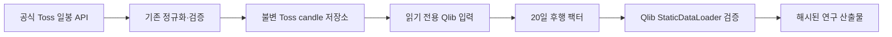

# Qlib Toss 일봉·팩터 입력 보강 설계

작성일: 2026-07-28  
상태: 승인된 설계

## 목적

현재 Qlib Stage 1은 Toss 정규화 DB를 읽기 전용으로 사용할 수 있지만, 정책
인스트루먼트 일봉과 시점-안전한 팩터가 없어 `factor_unavailable`로 보류된다.
공식 Toss 시세만 사용해 이 두 연구 입력을 보강한다. 이 기능은 IPS 검사,
정책 활성화, 주문 또는 매매 판단을 만들지 않는다.

## 선택한 접근

기존 `market sync`에 명시적 연구 전용 모드를 추가한다.

- `--research-only`는 Toss 일봉을 수집·정규화·불변 저장만 한다.
- 이 모드에서는 동적 배분 평가와 정책 후보 저장을 호출하지 않는다.
- `--target-points`는 필요한 과거 일봉 수를 지정한다. Qlib 실행은 기본적으로
  3년(756 거래일)을 요청해 20일 팩터 warm-up과 20·60일 사후 검증 구간을 남긴다.
- 종목 대상은 관측된 Toss identity와 활성 정책의 주식형 벤치마크, 지수 대상은
  활성 정책의 시장 지수 벤치마크다. 다른 제공자, 대체 종목, 임의 보간은 쓰지
  않는다.
- 기존 `insert_candles`의 fingerprint·충돌 거부 계약을 그대로 사용한다.

연구 입력을 읽을 때 각 시계열에 20 거래일 후행 수익률
`close[t] / close[t-20] - 1`을 팩터로 붙인다.

- `t` 시점 팩터는 `t`와 그 이전 20개 관측만 사용한다. 미래 행을 읽지 않는다.
- warm-up을 끝내지 못한 초기 행은 Qlib adapter 입력에서 제외한다. 임의의 0이나
  상수로 채우지 않는다.
- 가격 공백·비정상 OHLC·조정 불가 주식은 기존 source 검증에서 실패 폐쇄한다.
- 팩터는 `toss_market_candles`에 저장하지 않고, 해시된 Qlib 연구 입력 안에서만
  파생한다. 따라서 원본 Toss 관측값은 바뀌지 않는다.

이 팩터는 Stage 1의 Qlib `StaticDataLoader` 적합성을 실제 데이터로 검증하기 위한
단일 설명변수다. 모델 훈련, Alpha158/Alpha360, 신규 매매 신호 또는 Stage 2
포트폴리오 백테스트는 이번 범위에 포함하지 않는다.

## 데이터 흐름

`research-only` 경로는 S까지만 쓰며, 정책·스냅샷·평가·후보 테이블에는 쓰지
않는다. Qlib Stage 1은 R 이후만 수행하며 기존처럼 목표 정책 판단은
`inconclusive / stage2_not_run`으로 고정한다.

## 오류 처리와 실행 경계

- Toss 인증·응답·페이지 cursor·OHLC·조정가격 오류는 해당 동기화를 실패시킨다.
  부분 수집 결과로 Qlib 실행을 자동 시작하지 않는다.
- 동일 시점의 다른 candle 내용은 충돌 오류로 중단한다. 기존 관측값을 덮어쓰지
  않는다.
- 수집이 끝난 뒤 Stage 1은 별도 명령으로만 시작한다. 수집 성공이 연구 신호나
  정책 변경을 의미하지 않는다.
- 실제 Toss 호출은 구현 검증 후 사용자가 요청한 동기화 실행에서만 한다.

## 검증

- 연구 전용 모드가 candle 저장 외 정책 후보·평가 저장을 호출하지 않는지 검사한다.
- 대상 종목, 페이지 수, `target_points`, 중복과 충돌 거부를 Toss fixture로 검사한다.
- 20일 팩터의 정확성, warm-up 제외, 결측·공백 실패, 미래 데이터 미사용을 검사한다.
- Qlib capability가 유효 팩터 입력에서 `data_adapter_suitable=true`가 되는지,
  누락 데이터에서는 계속 실패 폐쇄하는지 검사한다.
- 기본 테스트, 연구 격리 환경 테스트, formatter·linter를 통과시킨다.
- 마지막으로 인증된 Toss DB에 연구 전용 동기화를 실행하고 Stage 1 JSON·산출물을
  확인한다. 결과는 데이터 적합성만 보고하며 매매 또는 IPS 상태로 해석하지 않는다.
