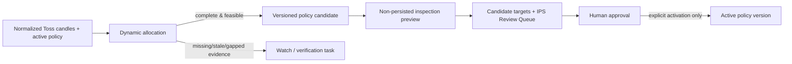

# Technical target candidate adoption

Status: approved design increment (2026-07-31)

## Context

The active IPS policy provides strategic target weights. The existing dynamic
allocation service already calculates regime and instrument target ranges from
normalized Toss market evidence, but the technical ranges need an explicitly
role-aware severe-risk rule and a way to inspect the resulting candidate's IPS
review items before any activation.

The user approved a candidate-and-human-approval workflow. The active policy,
account snapshots, and order facts remain unchanged until a person explicitly
activates a versioned policy.

## Decision

- Treat the active policy as the strategic anchor, not as the final operating
  target whenever valid technical evidence exists.
- Generate an immutable policy candidate only when all required benchmark and
  instrument evidence is complete and all proposed target ranges are feasible.
- Let the existing inspection engine evaluate that proposed policy in preview
  mode, so prospective `OK`, `Watch`, `Review`, and `Action` classifications
  remain owned by one backend classification source.
- Do not create a candidate or a prospective inspection when market evidence
  is missing, stale, gapped, unsupported, or infeasible. Return the evidence
  verification task instead.
- Do not activate a policy, create an order, calculate an order quantity, or
  infer an execution instruction.

## Alternatives considered

1. Automatically activate technical targets after every market sync. Rejected:
   incomplete data and short-horizon regime changes would alter the long-term
   policy without human review.
2. Keep technical evidence as display-only information. Rejected: it would not
   provide an accountable target candidate or a prospective review of target
   gaps.
3. Generate a fully validated candidate plus a non-persisted inspection
   preview, then require human activation. Chosen: it makes the technical
   adjustment inspectable while preserving policy and order guardrails.

## Role-aware target ranges

The range construction remains policy-bounded and deterministic.

| Signal | Core | Satellite | Experiment |
|---|---|---|---|
| supportive | strategic anchor to policy maximum | strategic anchor to policy maximum | strategic anchor to policy maximum |
| neutral | policy minimum to policy maximum | policy minimum to policy maximum | policy minimum to policy maximum |
| adverse | policy minimum to strategic anchor | policy minimum to strategic anchor | policy minimum to strategic anchor |
| severe | policy minimum to strategic anchor | 0 to policy minimum | 0 to policy minimum |

`severe` remains evidence detail, not an IPS `Action`. A severe core signal
requires role review but retains its strategic floor; the stricter satellite
and experiment rule limits future allocation options without granting trade
authority.

## Candidate and preview flow



`market context` and `/api/market-context` return a `candidate_evaluation`
field only when `context.proposed_policy` exists. It is the result of the
existing preview inspection service, is marked non-persisted, and contains no
order-sized fields. Otherwise the field is `null`; callers use the existing
context reason and verification task.

The existing candidate persistence remains deduplicated by base policy version
and candidate hash. The preview does not insert an evaluation run.

## API and CLI contract

The existing one-JSON-object CLI contract is preserved. `market context` adds
the nullable field below without removing existing fields:

```json
{
  "candidate_evaluation": {
    "persisted": false,
    "snapshot_id": 10,
    "evaluation": {"allocation_state": "complete"}
  }
}
```

The API exposes the same field under `data`. The preview must preserve the
inspection engine's own status, priority, queue class, suggestion, trigger,
and verification-task fields. Neither surface reclassifies a status.

## Failure behavior

- Incomplete technical evidence: `candidate_state=observe`, no candidate
  preview, and the evidence verification task remains visible.
- Infeasible instrument ranges: `candidate_state=observe`, no candidate
  preview, and the range-feasibility verification task remains visible.
- Preview failure after candidate generation: return the market context and a
  machine-readable preview error; do not activate a policy and do not hide the
  candidate context.
- Missing account source in the preview: retain the preview engine's
  `not_evaluable` result and its blocking verification item; do not infer
  target gaps.

## Verification

Tests cover:

- severe core ranges retaining the policy minimum through strategic target;
- severe satellite and experiment ranges retaining 0 through policy minimum;
- complete candidates exposing a non-persisted prospective inspection from the
  CLI and API;
- incomplete or infeasible evidence producing no prospective inspection;
- preview failures returned as machine-readable errors without activation;
- candidate review statuses originating from the inspection engine; and
- absence of order, quantity, execution, price, or timing fields.

Run focused dynamic-allocation, CLI, and API contract tests, then the full
test suite. Verify a real latest snapshot only through a read-only preview;
do not activate a policy during verification.

## Adversarial review

- A technical signal cannot lower a core holding to zero without an explicit
  role-policy change.
- A severe signal does not itself become `Action` or authorize a transaction.
- Candidate policy persistence and inspection preview are distinct: preview is
  non-persisted and activation remains explicit.
- Missing Korean-market or other source data blocks a candidate instead of
  creating a false-precision target.
- CLI and API do not duplicate inspection status logic.
